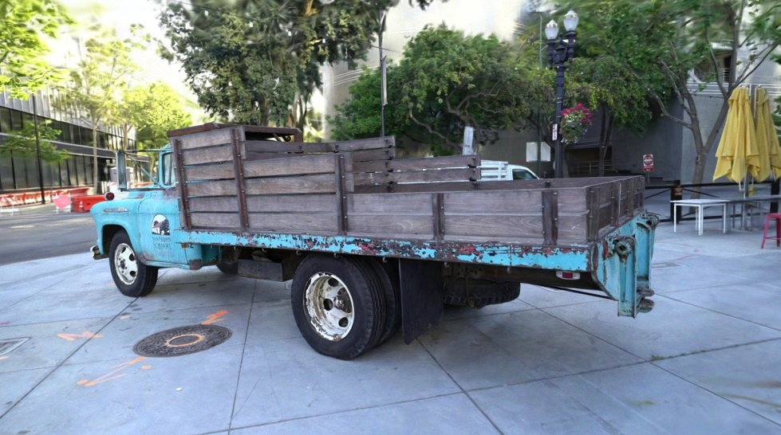

# Gaussian Splat Compression

A reproducible pipeline that trains 3D Gaussian Splatting scenes and compresses
them about 19x, from roughly 236 MB to 12 MB, for a PSNR loss of at most 0.2 dB
on held-out views. The result is a single `.splatc` file that a WebGL viewer
loads and renders in the browser, including view-dependent colour.

**Live viewer:** https://vedjoshi.github.io/gaussian-splat-compression/

[](https://vedjoshi.github.io/gaussian-splat-compression/)

## What it does

1. **Train** a scene from a COLMAP reconstruction with [gsplat](https://github.com/nerfstudio-project/gsplat).
2. **Quantise** the higher-order spherical harmonics, 76% of the raw bytes, into a 4,096-entry vector codebook.
3. **Prune** the 20% of Gaussians that contribute least to the training views.
4. **Pack** everything into one checksummed `.splatc` container with a per-block codec.
5. **View** it in the browser: a fork of [antimatter15/splat](https://github.com/antimatter15/splat) that decodes the container and evaluates degree-3 SH on the GPU.

Every stage is scored on held-out views against the uncompressed scene, with
quality limits fixed before each measurement.

## Results

| Scene | Raw PLY | `.splatc` | Ratio | PSNR change | Viewer vs gsplat | First frame, live site |
|---|---:|---:|---:|---:|---:|---:|
| truck | 236.0 MB | 12.3 MB | 19.22x | -0.142 dB | 36.0–36.9 dB | 2.1 s |
| train | 236.0 MB | 12.3 MB | 19.14x | -0.191 dB | 37.6–39.4 dB | 1.2 s |
| playroom | 198.2 MB | 10.3 MB | 19.33x | -0.004 dB | 31.8–34.4 dB | 1.0 s |

In the browser, frames run at the display's 75 Hz on an RTX 4050 Laptop GPU.
The full measurements, ablations and negative results are in
[docs/EVALUATION.md](docs/EVALUATION.md). They include:
- the container is 3% larger than the PNG-family baseline it replaces;
- opacity ranking prunes as well as contribution ranking.

## Getting started

### Requirements

- Windows, Python 3.11, an NVIDIA GPU with CUDA Toolkit 12.8
- Visual Studio 2019 Build Tools (C++ workload), to build gsplat's CUDA kernels
- Node and Playwright's Chromium, only for the viewer tests

### Setup

From the repository root:

```bat
%LOCALAPPDATA%\Programs\Python\Python311\python.exe -m venv .venv
.venv\Scripts\python.exe -m pip install --upgrade pip wheel setuptools
.venv\Scripts\python.exe -m pip install torch==2.7.1 torchvision==0.22.1 --index-url https://download.pytorch.org/whl/cu128
scripts\env.bat
.venv\Scripts\python.exe -m pip install -r requirements.lock.txt --no-build-isolation --extra-index-url https://download.pytorch.org/whl/cu128
.venv\Scripts\python.exe -m pip install -e .[dev]
.venv\Scripts\python.exe scripts\setup_env.py
.venv\Scripts\python.exe -m playwright install chromium
```

`requirements.lock.txt` pins the tested stack; regenerate it with `pip freeze --exclude-editable`.

### Compress a scene

Truck end to end, about 30 minutes on an RTX 4050:

```bat
scripts\env.bat
.venv\Scripts\python.exe scripts\get_data.py
.venv\Scripts\splatpipe.exe run data\tandt\truck --config configs\truck.toml --out out
.venv\Scripts\splatpipe.exe prune out\truck --scene data\tandt\truck --retain 95,90,80,70
.venv\Scripts\splatpipe.exe export out\truck --scene data\tandt\truck
```

Each step's output:
- `run`: trains and writes `out/truck/artifacts/scene.ply`.
- `prune`: ranks every Gaussian and measures the retained-count sweep.
- `export`: writes `out/truck/export/scene.splatc` and scores that exact file on held-out views.

`get_data.py tandt/train db/playroom` fetches the other two scenes; their
configs are in `configs/`.

### View it

```bat
.venv\Scripts\python.exe -m scripts.viewer_harness
```

This serves the repository locally. Open
`<printed host>/viewer/index.html?url=/out/truck/export/scene.splatc`. Drag to
orbit and use WASD or the arrow keys to move. Add `&sh=0` for DC colour only.

### Use your own photos

The pipeline reads a COLMAP reconstruction:
- `images/`, with at least 8 images;
- `sparse/0/cameras.bin`, `images.bin` and `points3D.bin`.

Run COLMAP on your photos first, then point `splatpipe run` at that directory.

### Tests

```bat
.venv\Scripts\python.exe -m pytest -q
cmd /c "call scripts\env.bat >nul 2>&1 && .venv\Scripts\python.exe -m pytest -q -o addopts="
```

The first command is the fast CPU tier: 301 tests, with 23 slow ones deselected.
The second is the complete tier: 324 tests, including GPU training, rendering
and Chromium.

## Repository layout

| Path | Purpose |
|---|---|
| `src/splatpipe/` | Pipeline package: training, codecs, pruning, container, benchmark |
| `viewer/` | WebGL viewer for `.splatc`, forked from antimatter15/splat (MIT) |
| `site/` | Scene picker and `SHA256SUMS` pinning the deployed scenes |
| `configs/` | Per-scene training configuration |
| `scripts/` | Data download, environment setup, site build, viewer measurement |
| `tests/` | Fast CPU tier and complete GPU and browser tier |
| `docs/EVALUATION.md` | All measured results |

The site is built by `scripts/build_site.py` and deployed by
`.github/workflows/pages.yml`, which runs manually. Scene files are served from
Release `scenes-v1`; they are not committed.

Large datasets, trained artifacts, third-party checkouts and virtual
environments are excluded from Git.

## Status

Milestones 1–7 are complete:
1. Training pipeline
2. Benchmark harness
3. SH quantisation
4. Contribution pruning
5. Container format
6. Browser viewer
7. Three-scene deployment

Milestone 8, the writeup, is next.

## Data and licences

Truck and Train are from [Tanks and Temples](https://www.tanksandtemples.org/)
(Knapitsch et al. 2017), CC BY 4.0 with an added clause prohibiting commercial
use. Playroom is from [Deep Blending](http://visual.cs.ucl.ac.uk/pubs/deepblending/)
(Hedman et al. 2018), whose project page states no licence; it is published
here with attribution only. The viewer is forked from antimatter15/splat under
the MIT licence.
